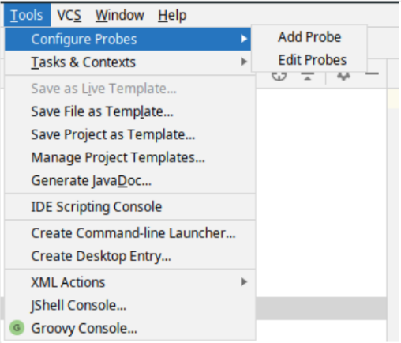
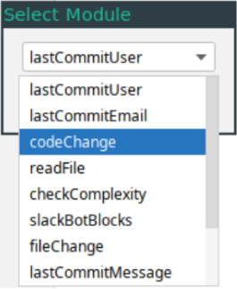
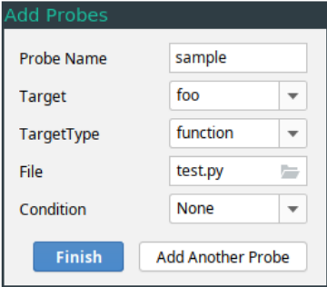

# LOSCAT Probe Configuration IDE Plugin

## Overview

The plugin works with any Jetbrains IDE (IntelliJ, PyCharm, etc...). It provides a dialog interface for adding probes to a project and automatically generates the necessary probe configuration JSON files.

## Install

<https://www.jetbrains.com/help/idea/managing-plugins.html#>

Install the plugin zip archive from disk as indicated by the JetBrains documentation.

## Set Up Repository

Plugin is not yet designed to work with `config.cfg`. To use the plugin, there should be a directory within the project repository called LOSCAT, and two subdirectories within the LOSCAT directory called `module_configs` and `probe_configs`. The `module_configs` and `probe_configs` directories should contain the module configuration JSON lists and the probe configuration JSON lists, respectively. Running Add Probe will automatically create these directories if they don't already exist.

## Using the Plugin (General)

Once the Plugin is installed, the _Configure Probes_ option is accessible via the _Tools_ Menu. From here, it is possible to add new probes or edit existing probe files. 

### Add Probe

The general process for creating a probe configuration file is as follows:

1. Select _Tools/Configure Probes/Add Probe_.
2. Select Module Type from the list.
3. Provide parameters needed by specified module. 
4. Add another probe to the current file with _Add Another Probe_, if necessary (Return to (2)).
5. Finish and Name Probe JSON file.
6. JSON file is generated and placed in `LOSCAT/probe_configs`.

To refer to the return value of a probe defined in the same file, use it's name surrounded by braces (ie. `{name}`). In order for a probe to refer to the return value of another probe, both probes must be defined in the same file. Probes which are already defined in the current file are accesible via the dropdown menu next to textfields associated with the current probe's parameters.

Note also that probes must be defined _in order_. If a probe refers to the return value of another probe in the file, it must be defined after the first probe. For example, to construct a probe which retrieves the last git commit author and posts it to slack, the `lastCommitUser` probe must be defined before the `slackBotSimple` probe.

### Edit Probe

The _Tools/Configure Probes/Edit Probe_ option allows for basic editing of probe parameters. The general process for editing a probe configuration file is as follows:

1. Select _Tools/Configure Probes/Edit Probe_.
2. Choose probe file to edit from list.
3. Edit parameters associated with each of the probes in the selected probe file as desired.
4. Finish and save changes.

More advanced editing is not currently supported. To make changes such as replacing, removing, or adding new probes to a probe file, remake the probe file from scratch using the Add Probe option and delete the old probe file.

### Screenshots

