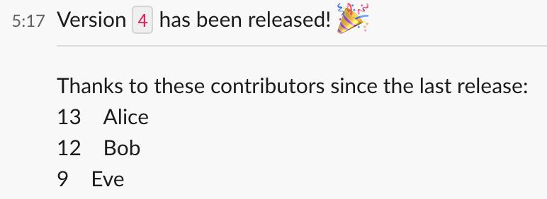

# Example Probe/Module Walkthrough

This walkthrough serves an example of how a developer can create a customized probe (and accompanying modules) to accomplish a specific goal that they have.  

This example has been designed to highlight different aspects of SAAD, including:

* An example of a specific use case where SAAD can be used to easily automate actions based on source code monitoring.
* The general process for creating a new probe.
* Creation of a simple module (`lastTag`).
* More advanced module creation involving a separate executable file and different parameters (`committersSince`).
* Combining new modules with existing ones to create a customized probe.

## Introduction

The general idea behind this probe is that the developer wants to automatically send a Slack message on release of a new version, with the message including the new version number and also a list of git contributors since the previous release (the last git tag).  

Example Slack message:


## Probe & Module Design

### Probe Pseudocode

```
if [version.txt has changed]:
	postToSlack(
		...[new contents of version.txt]...
		...[list of git contributors since [last git tag]]...
	)
```

### Necessary modules

The pseudocode for this probe uses some modules that already exist, but it also uses functionality not provided by default from SAAD.  This means that we will need to create additional modules.

All necessary modules to create this probe:
* Check if a file (`version.txt`) has changed - accomplished with default `fileChange` module.
* Post a message to slack - accomplished with default `slackBotBlocks` module, which allows for Block-Kit formatted Slack messages.
* Get contents of a file (`version.txt`) - accomplished with default `readFile` module.
* Get the last git tag in a repo - need to create a new module (`lastTag`).
* Get a list of git contributors since a given tag - need to create a new module (`committersSince`).

## Module creation

Two additional modules, `lastTag` and `committersSince`, need to be made.

### `lastTag` Module

This module gets the last git tag in a repository.  This can be accomplished with a simple `bash` command, so we create and add the following module.

```json
"lastTag": {
  "command": "cd {HEAD} && git describe --tags --abbrev=0"
}
```

Note that we use `{HEAD}` to `cd` into the directory containing the new version of the code before running the `git describe` command.  `{HEAD}` is always accessible, and refers to the directory containing the new version of the source code.

### `committersSince` Module

This module gets a list of git commiters who have contributed to a repository since a given tag.

The code for this module will be put in a `bash` shell script, which is then referenced in the module.  The script takes in the directory of a git repo and a git tag, and returns a list of users and commit counts (sorted by commit count) who have contributed since the given tag.  Although in this case the module is a simple `bash` script, users can use whatever they are comfortable with, as long as they connect it in the module code to SAAD.

Shell script `committers.sh`:
```shell script
#!/bin/bash
# usage: committers.sh [directory] [previous version]
dir=$1
last_tag=$2

cd "$dir" || exit
committers=$(git shortlog "$last_tag"..HEAD -sn)

echo "$committers"
```

Example output:
```console
$ ./committers.sh /example-repo/ example-tag
     13    Alice
     12    Bob
     9     Eve
```

`committers.sh` is then placed in `scripts/probes/`, and the following module code is added.

```json
"committersSince": {
  "command": "./scripts/probes/committers.sh {dir} {tag}"
}
```

(`committersSince` could easily have been accomplished without a `bash` script file in a way similar to `lastTag`, but this method has been used to demonstrate creating a module using an external executable and how to connect it to SAAD.  Also, replacing `{dir}` with `{HEAD}` would have meant cleaner code in this specific use case tracking the current repo.)

## Probe Creation

Now that we have all the modules necessary, the actual probe can be created.

### Probe Pseudocode

Rewritten version of the above pseudocode using the actual module names and including variables:
```
versionBump = fileChange(version.txt)
newVersion = readFile(version.txt)
oldTag = lastTag()
contributors = committersSince({HEAD}, {oldTag})

if {versionBump}:
	slackBotBlocks(
		...{newVersion}...
		...{contributors}...
	)
```

### Actual Probe 

To call a module, we need to add a block for the module and include the correct `type`.  When we want to use the output of a module, we make sure to also include a `name` which can be referenced later to get the output.  Any parameters that the module needs are provided in the `config` list, and the `condition` field determines whether the given module actually runs.

```json
[
  {
    "name": "versionBump",
    "type": "fileChange",
    "config": {
      "file": "version.txt"
    }
  },
  {
    "name": "newVersion",
    "type": "readFile",
    "config": {
      "path": "version.txt"
    }
  },
  {
    "name": "oldTag",
    "type": "lastTag",
    "config": {}
  },
  {
    "name": "contributors",
    "type": "committersSince",
    "config": {
      "dir": "{HEAD}",
      "tag": "{oldTag}"
    }
  },
  {
    "type": "slackBotBlocks",
    "config": {
      "condition": "{versionBump}",
      "channel": "[insert channel ID here]",
      "message": "Version {newVersion} released!",
      "blocks": "[{\"type\": \"section\",\"text\": {\"type\": \"mrkdwn\",\"text\": \"Version `{newVersion}` has been released! :tada:\"}},{\"type\": \"divider\"},{\"type\": \"section\",\"text\": {\"type\": \"plain_text\",\"text\": \"Thanks to these contributors since the last release:\\n{contributors}\",\"emoji\": true}}]"
    }
  }
]
```

(Note: the convoluted `blocks` parameter for the `slackBotBlocks` module is a message that has been formatted with Block-Kit and the complexity has nothing to do with SAAD.  A Block-Kit formatted message is used in this case as a demonstration and to make a better message.)

## Conclusion

At this point a probe has been created that automatically sends a message with the new version number and git contributors to the new version to Slack when `version.txt` is updated.


SAAD has been designed to give users the power to easily create their own probes and modules to allow them to monitor their source code in a way that is extensible and powerful but also simple for users to use.  With any luck this example has been a good demonstration of the process of creating a new probe and necessary modules, and you might even be already thinking of how SAAD can be helpful in your situation.
