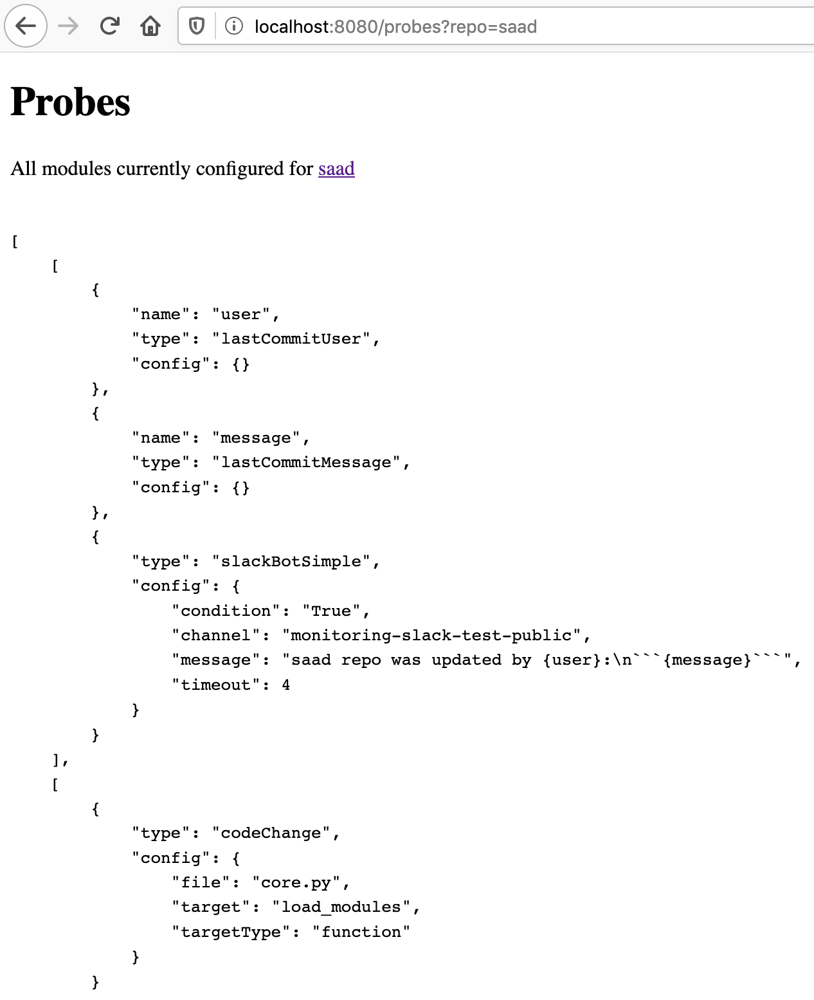
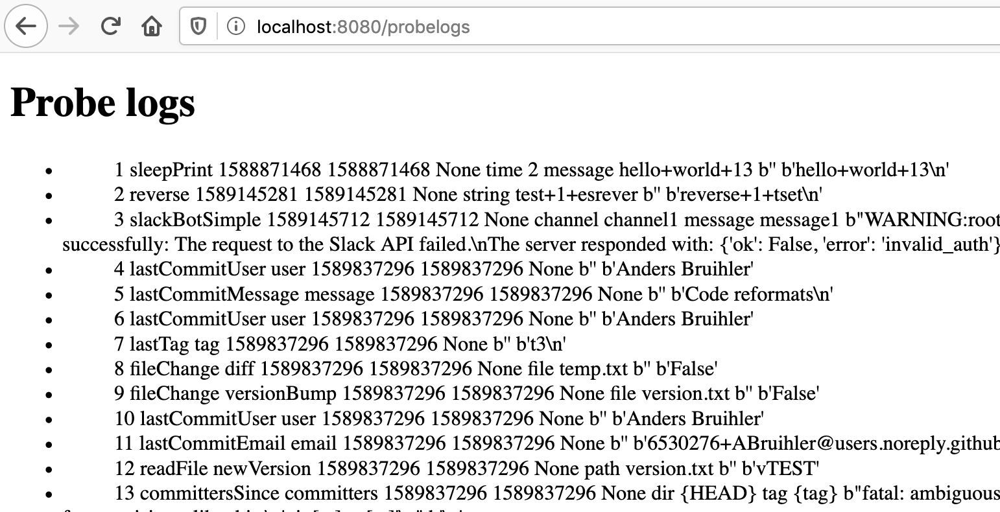
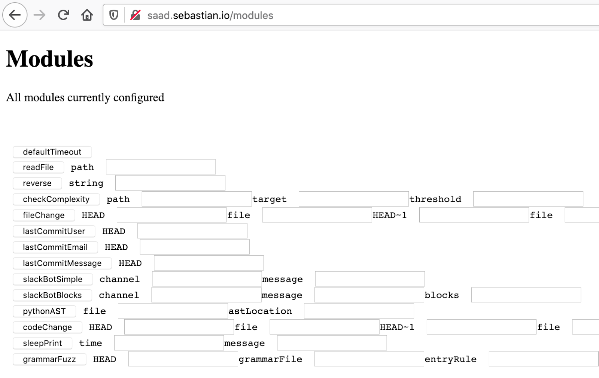
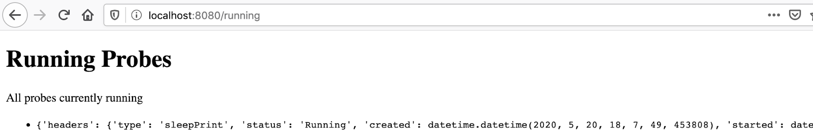

# Website

SAAD includes a basic website with a few different pages to add another method for users to interact with and also to show some further information tracked about probes.

The current website is relatively bare-bones in terms of formatting, but is functional.

# Authentication

Authentication is checked with HTTP Basic authentication.  

# Pages

## `/probes`

The `/probes?repo={repo_name}` path shows all probes for a given tracked repository.

### `/api/probes`

`/api/probes?repo={repo_name}` returns all the probes for the given tracked repository in JSON format.

## `/probelogs`

The `/probelogs` path shows the history of run probes, including the start time, end time, and various parameters that the probe used.  

## `/modules`

The `/modules` path allows the user to set parameters for the configured modules and to start those modules running.  This can be useful for testing probe configurations and manually triggering modules.

### `/api/modules`

`/api/modules` returns all the modules that SAAD is configured with in JSON format.

## `/running`

The `/running` path shows the currently running probes.  Additional interactivity here such as killing or restarting probes could be added here (but not currently implemented).

